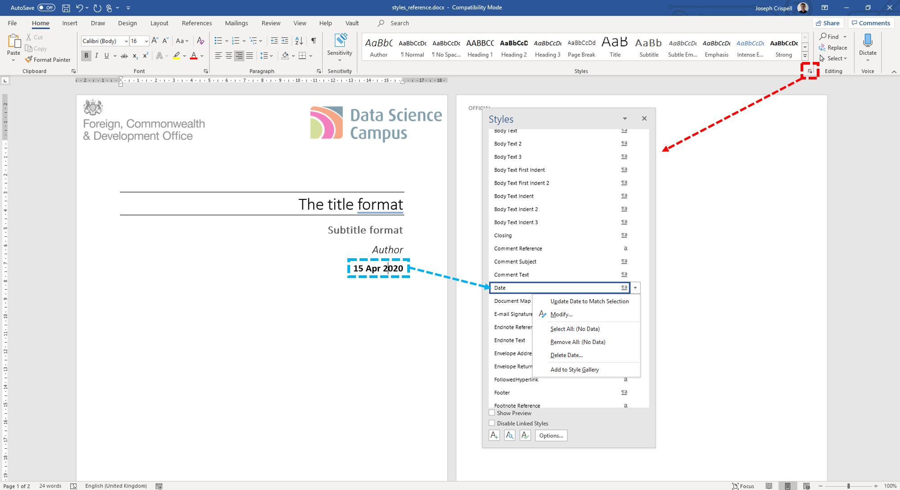
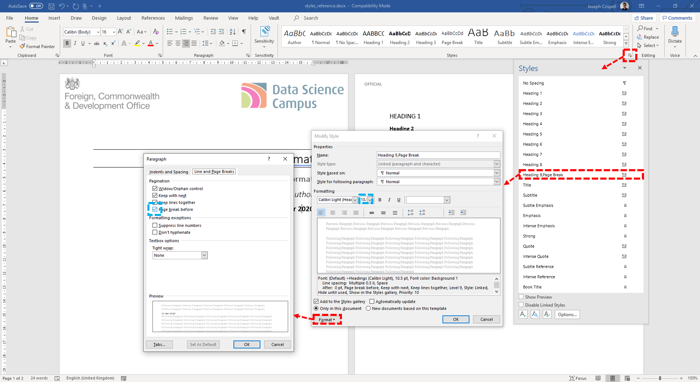

```{r setup, include=FALSE}
knitr::opts_chunk$set(echo = FALSE)
```

######### Page break

# What am I

I am a word document that has been created using an [Rmarkdown](https://rmarkdown.rstudio.com/articles_intro.html) script. Rmarkdown is an extension of the [R](https://www.r-project.org/about.html) programming language that is used for generating documents. To set the output of Rmarkdown to a word document, you'll need to edit the [YAML](https://ourcodingclub.github.io/tutorials/rmarkdown/#identify) header section slightly:

```
---
title: "Creating a word document using Rmarkdown"
subtitle: 'Getting started'
author: "Joseph Crispell"
date: "`r format(Sys.Date(), '%d %b %Y')`"
output: 
  word_document:
    reference_docx: styles_reference.docx
---
```

# Building a word document using Rmarkdown

## Styles template

When building a word document using Rmarkdown, we rely on a styles template - the *styles_reference.docx* file referred to in the above YAML header. The template used for the current document is available [here](](https://github.com/datasciencecampus/gov-uk-rap-materials/raw/master/CreatingAWordDocument/styles_reference.docx)). The styles template is a standard word document that we use to set the style of different elements of our word document (titles, dates, headers, etc.). See the screenshot below for how to set styles in word:



There are key elements that are directly used by the YAML header elements such as the **Title**, **Subtitle**, **Author**, **Date** elements. The styles template also allows you to edits other comment elements like headers, footers, page numbers etc.

######### Page break

## Including page breaks

There's a trick to adding page breaks into your word document, I edited the paragraph settings for the **Heading 9** style to include a page break, reduce the font size and set colour to white, I can then use "#########" to force a page break:


# Some helpful resources

The following resources were very useful for getting started with generating word document outputs with Rmarkdown:

- [Detailed tutorial about Rmarkdown word outputs](https://rmarkdown.rstudio.com/articles_docx.html)
- [Creating the style template](https://bookdown.org/yihui/rmarkdown-cookbook/word-template.html)
- [Modifying and creating styles in word](https://support.office.com/en-us/article/Customize-or-create-new-styles-d38d6e47-f6fc-48eb-a607-1eb120dec563)
- [The code, images, and style template used to generate this document](https://github.com/datasciencecampus/gov-uk-rap-materials/tree/master/CreatingAWordDocument)
