```{r setup, include=FALSE}
knitr::opts_chunk$set(echo = FALSE)
```

<!-- Extra custom code to add "OFFICIAL" into the header -->

<script src="https://ajax.googleapis.com/ajax/libs/jquery/1.12.2/jquery.min.js"></script>

<script>
    $(document).ready(function() {
      $('slide:not(.title-slide, .backdrop, .segue)').append('<header label=\"OFFICIAL\"></header>');    
    })
</script>

<style>
  header:after {
    content: attr(label);
    font-size: 12pt;
    position: absolute;
    top: 10px;
    left: 10px;
    line-height: 1.9;
  }
</style>

<!-- END custom code block for header -->

<!-- Extra custom code for footnotes - taken from https://stackoverflow.com/questions/42690955/how-to-insert-footnotes-in-ioslides-presentations-using-rmarkdown -->

<!-- PRESENTER NOTES
To view notes press "p" during the presentation on each slides with notes and an element with notes inside will appear. 

Note that you can use presenter mode by adding "presentme=true" to presentation url ("my-presentation.html?presentme=true"). Turn off presenter mode by adding "?presentme=false" to the url.

More information on "ioslides" available here: https://bookdown.org/yihui/rmarkdown/ioslides-presentation.html.
-->

## What is a Analytical Pipeline? The ideal scenario

<br><br>

<p class="aligncenter">
    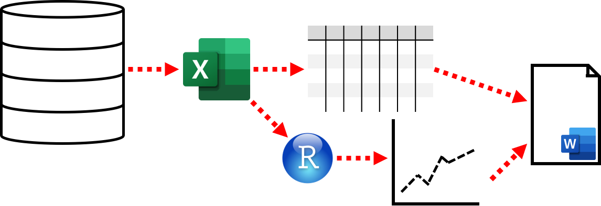
</p>

<div class="notes">
  Our ideal analytical pipeline has a clear set of steps that we do once in succession to create a final report.

  Here, we:

  1. Download some data and store it in an excel file, which we create a formatted table within
  2. We load the excel data into R to generate a chart
  3. We then copy and paste the formatted table and chart into a word document and add some text and formatting to create the final report
</div>

## What is a Analytical Pipeline? The reality...

<p class="aligncenter">
    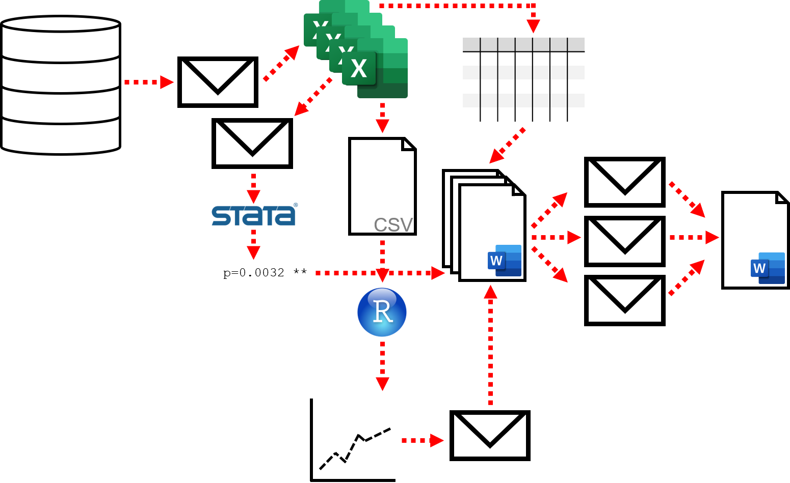
</p>

<div class="notes">
  In reality though, our ideal analytical pipeline can quickly become a complicated tangle of multiple file and data versions, programs, emails and final reports.
</div>

## What are the issues?


<br>

- Lots of manual steps
- Hard to reproduce
- Mistakes are easily made and hard to track
- The steps aren't recorded
- Using multiple independent tools
- How do we keep track of which file versions people have?

<div class="notes">
  There are some key issues with this type of analytical pipeline:
  
  - Each step is manual and has to be completed in turn
  - It is difficult to teach someone else to replicate the process
  - Because each step is manual mistakes can be made
  - The different steps involved are often note recorded nor is how they can change
  - The pipeline combines multiple different programs
  - There isn't a way of keeping track of changes to files and who made them
</div>

## What is a Reproducible Analytical Pipeline (RAP)?

<a href="https://the-turing-way.netlify.com/introduction/introduction"> 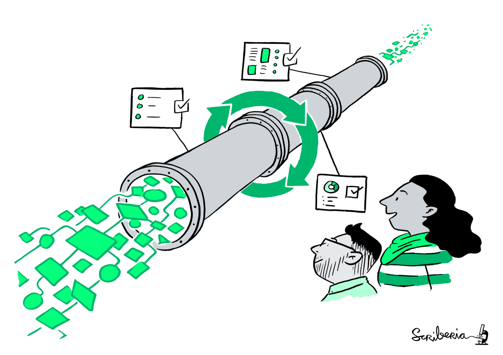 </a>

<br><br>

- It is easily repeatable
- It is easily extendable
- It is automated
- It minimises mistakes
- It is fast
- It builds trust

<p class="footnote">
  Image taken from: [The Turing Way](https://the-turing-way.netlify.com/introduction/introduction) book
</p>

<div class="notes">
  This is where a reproducible analytical pipeline can help. It is:
  
  - Easy for you or others to replicate
  - It can easily be adapted and improved and that process is recorded
  - It is automated, all steps are completed but with only one click of a button
  - Becuase it is automated, it minimises mistakes introduced by individual error, it is fast
  - By being transparent about how the pipeline works, recording how it is built and maintains we build trust in our outputs
</div>

## What does a RAP look like?

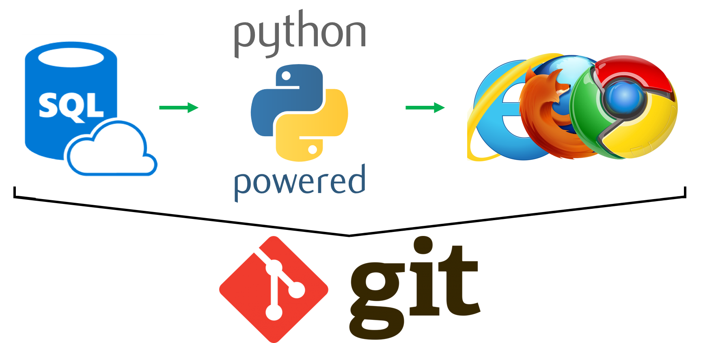

<div class="notes">
  A reproducible pipeline looks a bit like this.

  It uses an open-source tool like python.
</div>

## What does a RAP look like?

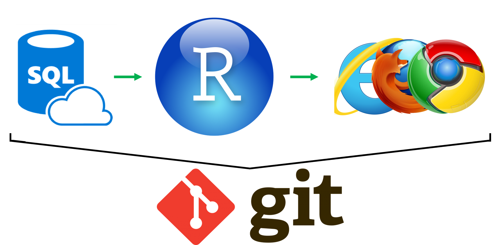

<div class="notes">
  Or R, to process, analyse and report a particular dataset.

  The process is handled by a single program (R or python in these examples) and the pipeline's development and maintenance is overseen by a version control system like git.
</div>

## All the functionality in one place


<div class="notes">
  With tools like R or python, they have all the functionality to process, analyse and report data in one place. 

  They are also designed to handle large and complex datasets efficiently.

  Also, R and python are open-source and free for anyone to use!
</div>

## What are the benefits?

<a href="https://the-turing-way.netlify.com/introduction/introduction">  </a>

<br>

- Easy for others to use
- Others can change and adapt
- All steps are recorded
  - Including whilst it is built
- Automated and fast
- Open and promotes trust

<p class="footnote">
  Image taken from: [The Turing Way](https://the-turing-way.netlify.com/introduction/introduction) book
</p>

<div class="notes">
  A reproducible analytical pipeline is:
  
  - Easy to use, often with a single click of a button
  - It can easily be adapted by you and others
  - All steps for building and maintaining the pipeline are recorded
  - It is automated, replicating hours or days of work in seconds
  - Because everything is documented and open, people can see how we have created our outputs and replicate them for themselves - building trust
</div>

## Is it Data Science?

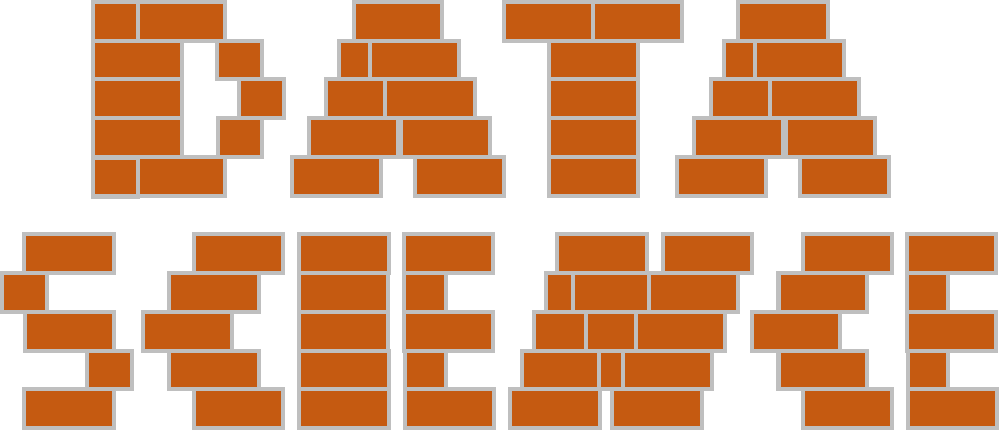

No, it is a building block that's essential for data science!

<div class="notes">
  Reproducible Analytical Pipelines are the building blocks of data science, they allows us to build open, robust, and flexible tools. 
  
  They create an open and transparent community where data science can thrive!
</div>

## What do we need?

- Open-source tools
- Version control with `git`
- To consider reproducibility
- Time to learn

<a href="https://git-scm.com/">  </a>
&nbsp;&nbsp;&nbsp;&nbsp;
<a href="https://rstudio.com/">  </a>
&nbsp;&nbsp;&nbsp;&nbsp;
<a href="https://www.python.org/">  </a>
&nbsp;&nbsp;&nbsp;&nbsp;
<a href="https://www.w3schools.com/sql/sql_intro.asp"> 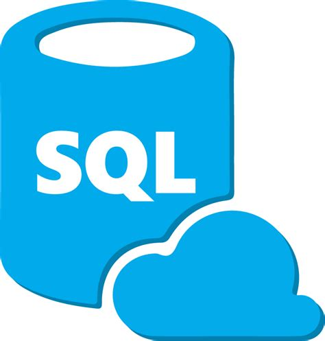 </a>
&nbsp;&nbsp;&nbsp;&nbsp;
<a href="https://www.java.com/en/">  </a>

<div class="notes">
  The beauty of a reproducible analytical pipeline is that they don't need much, just open-source tools and version control. THat's what make them so easy for others to use and adapt.
  
  They do take time to build though, we need to carefully map out each of steps required from downloading the data to generating a report.
  
  We need to be ready to devote a considerable amount of time to learn the necessary skills.
</div>
  
## Why open-source instead of proprietary?

<a href="https://the-turing-way.netlify.com/introduction/introduction"> 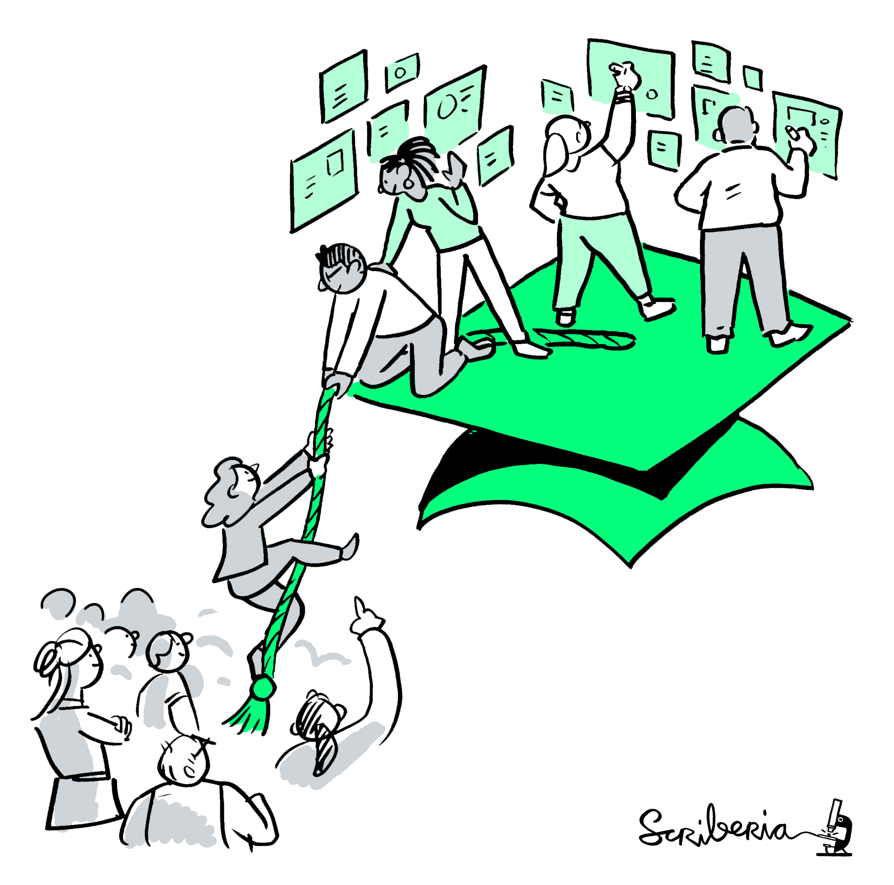 </a>

<br>

Open source tools are:

- Used by millions - huge supportive online community
- Flexible to all data sources
- Free for anyone to use - it is easier to share
- Flexible to all output types

<p class="footnote">
  Image taken from: [The Turing Way](https://the-turing-way.netlify.com/introduction/introduction) book
</p>

<div class="notes">
  So why do we keep say to use open-source tools?
  
  Open-source tools are free and available to anyone. Not only that but the code that builds them is free and available for anyone to use and adapt.
  
  Because they are free and available to anyone it is much easier to share a pipeline based on them because we don't need to worry about users having to purchase licences.
  
  They are powerful because they are free, millions of people use them, prompting these tools to be continually adapted and improved - creating the incredible powerful and flexible tools like R and python that underpin modern data science.
</div>


## What is version control?

Tracking the three **W**s: **W**ho made **W**hich change and **W**hy? <br><br>


<div class="notes">
  And what about version control - why is that important?
  
  We've all found ourselves looking a bunch of files with version 1, 2, 3, 4, final, final2 and so on. These are different versions of a file that we have worked on and changed through time.
  
  Version control does this for us, but much better. It tracks exactly what has changed in a file, when, by whom, and why keeping a constant record of how our pipelines develop and change through time.
</div>

## For example, take a look at this [presentation](https://github.com/datasciencecampus/gov-uk-rap-materials)

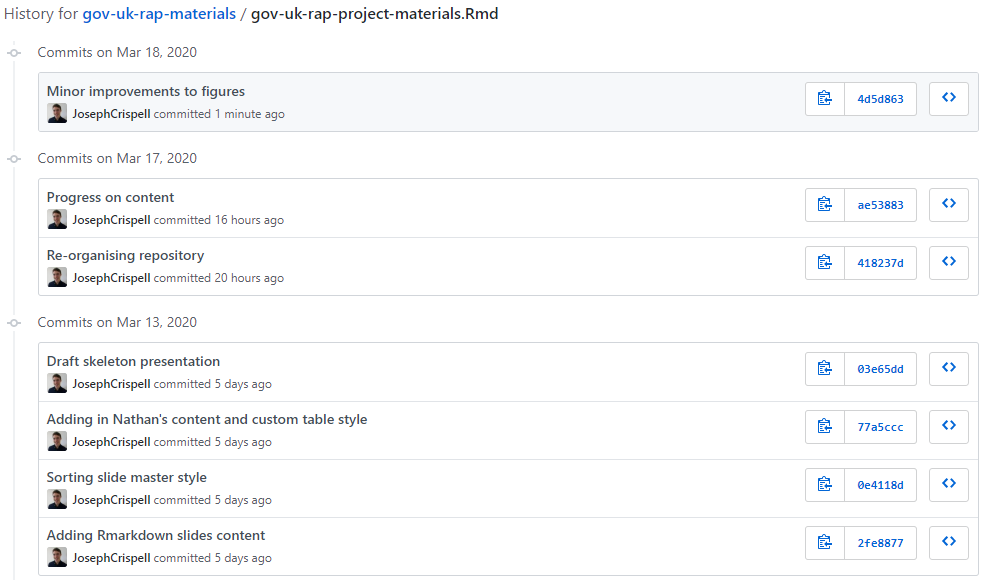

<div class="notes">
  Take this presentation for example, on GitHub (which is the tool we can use to host our version controlled code) we can see all the changes I have made to this presentation through time.
  
  This presentation is created using an R script and I am continually developing and adding to the content.
</div>

## Why use version control?


<br>

- One place to store your code
- You and collaborators are free to write and develop locally
- Complete documented history of all changes made
- Easy to share
- Your future self will thank you! 

<div class="notes">
  We use version control to track how our files are changing so we don't have to try and remember.
  
  It also allows us to collaborate on code with others, keeping track of who is making what changes, when and why.
  
  Using tools like GitHub it is easy to share any code we develop with others.
  
  As a data scientist I completely rely on version control for my work, I use it every day to track and share my work!
</div>

## Which version control should I use?

| Tool                                                              | Cost   | Where is master? | Advantage              | Disadvantage
| ----------------------------------------------------------------- | ------ | ---------------- | -----------------------|
| [Github](https://github.com/)                                     | Free   | Online           | Huge user base         | None!
| [Gitlab](https://about.gitlab.com/)                               | Free   | Local or Online  | Continuous integration | Smaller user base
| [Bitbucket](https://bitbucket.org/)                               | \$\$\$ | Cloud            | Cloud security         | Harder to share
| [Azure](https://azure.microsoft.com/en-us/services/devops/repos/) | \$\$\$ | Cloud            | Cloud security         | Harder to share

<br>

<a href="https://github.com/">  </a>
&nbsp;&nbsp;&nbsp;&nbsp;&nbsp;&nbsp;&nbsp;&nbsp;&nbsp;&nbsp;&nbsp;&nbsp;
<a href="https://about.gitlab.com/">  </a>
&nbsp;&nbsp;&nbsp;&nbsp;&nbsp;&nbsp;&nbsp;&nbsp;&nbsp;&nbsp;&nbsp;&nbsp;
<a href="https://bitbucket.org/"> 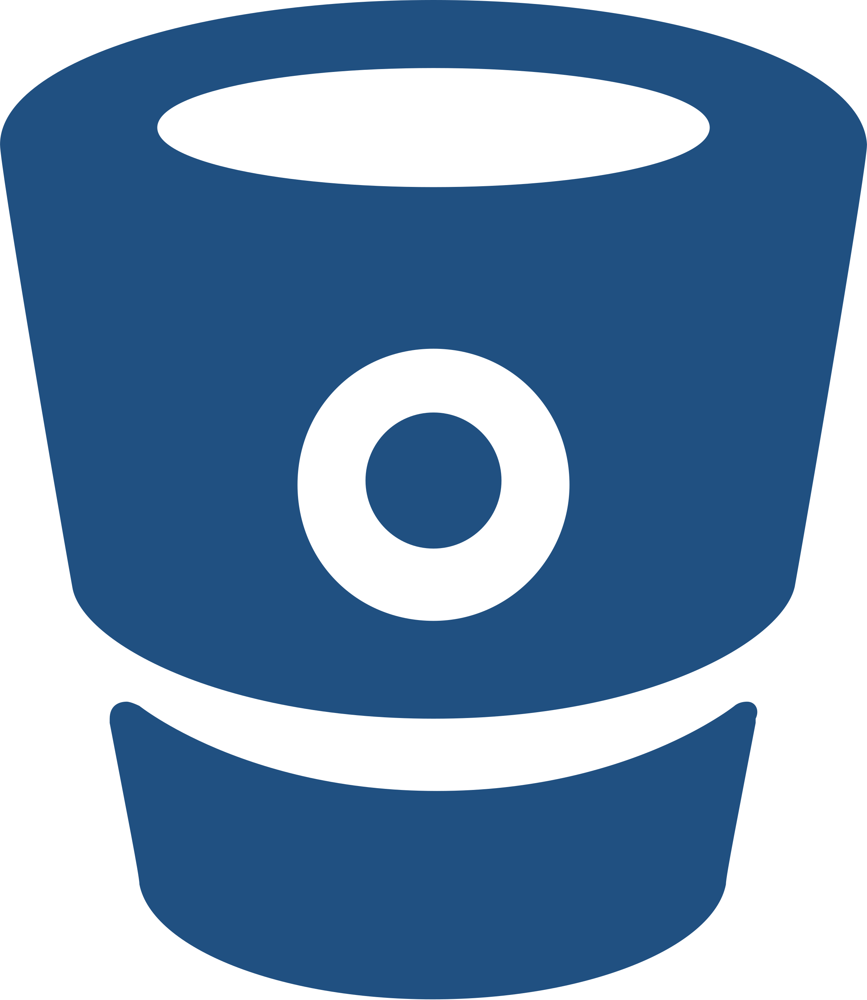 </a>
&nbsp;&nbsp;&nbsp;&nbsp;&nbsp;&nbsp;&nbsp;&nbsp;&nbsp;&nbsp;&nbsp;&nbsp;
<a href="https://azure.microsoft.com/en-us/services/devops/repos/">  </a>

<div class="notes">
  There are a variety of tools out there that we can use to manage our version control with git. My personal favourite is GitHub, it is quickly becoming the most popular tool and free and available to everyone!
</div>

## What do we mean by reproducible?

<a href="https://the-turing-way.netlify.com/introduction/introduction">  </a>

<br>

We want to look back and be able to repeat our work easily and quickly.

What are the benefits?

- Helps build trust
- Not reliant on single individual
- Can be adapted and re-used

<p class="footnote">
  Image taken from: [The Turing Way](https://the-turing-way.netlify.com/introduction/introduction) book
</p>

<div class="notes">
  So what does reproducible mean?
  
  We want to be able to repeat our work as easily, accurately and quickly as possible. If our outputs are be reproduced by us and others then people will trust in them.
  
  It means others can take repeat our work and adapt our tools to suit their needs.
</div>

## Making a RAP is difficult

Before we start, here are a few things to consider:

- IT infrastructure available
- Data privacy - where and how am I storing my data?
- Expertise - what training do I need?
- Legacy systems - what are the barriers to transitioning?

<div class="notes">
  Building a Reproducible Analytical Pipeline is difficult and it will take time. You need:
  
  - Access to the open-source tools
  - To make sure your data are secure and used appropriately
  - You need to learn to work with the open-source tools
  - And you need to consider whether there are any barriers to transitioning from an existing pipeline
</div>

## But it is worth it!

<p class="aligncenter">
    <a href="https://the-turing-way.netlify.com/introduction/introduction"> 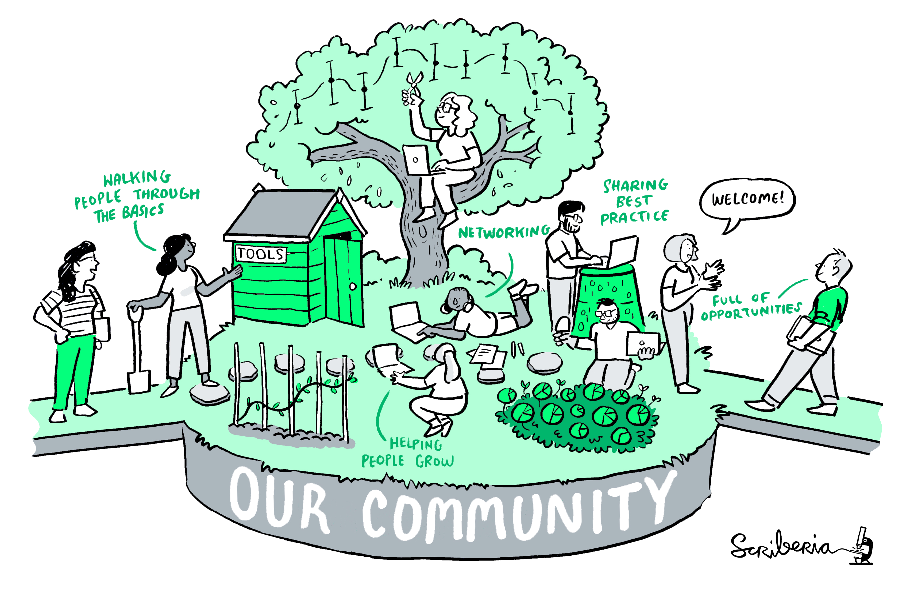 </a>
</p>

<p class="footnote">
  Image taken from: [The Turing Way](https://the-turing-way.netlify.com/introduction/introduction) book
</p>

<div class="notes">
  But it is worth it!
  
  You develop skills that can be applied to a maasive range of projects.
  
  You'll join the open-source community by creating your own open-source tools and helping to improves others.
  
  Your outputs will be robust and trusted.
</div>

## And we don't have to do it all at once

<br><br>
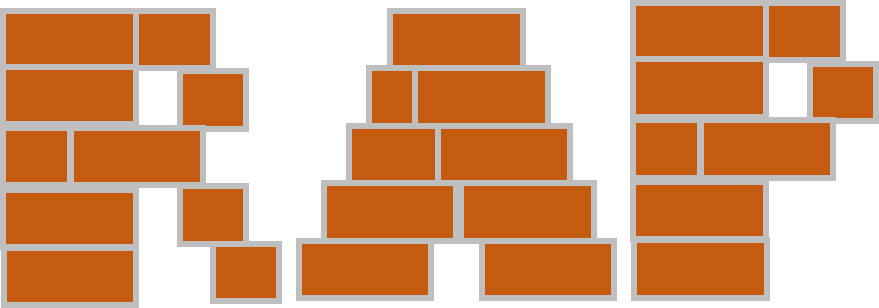

The building blocks of a RAP:

- Version control
- Using open-source tools
- Create reproducible code

<br>

\... are useful in their own right, each will improve the auditability, speed and quality of your work.

<div class="notes">
  And you don't have to do it all at once, take your time and learn and apply each of the essential components in time.
</div>

## RAP in practice

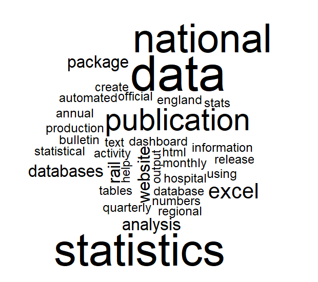

<br><br>

RAP has been successfully rolled out in 10s of projects across the UK government.

It is now part of the best practice [documentation](https://gss.civilservice.gov.uk/policy-store/quality-statistics-in-government/#reproducible-analytical-pipelines-rap-).

Work continues across the government to roll out RAP to more projects.

<div class="notes">
  You're not alone, across the UK government analysts are learning about the power of Reproducible Analytical Pipelines and beginning to build their own.
  
  As we develop our pipelines we adding to the open-source community, making it easier for people around to world to generate robust and trusted statistics.
</div>

## Packages to help us with RAP

<a href="https://ukgovdatascience.github.io/govdown/"> 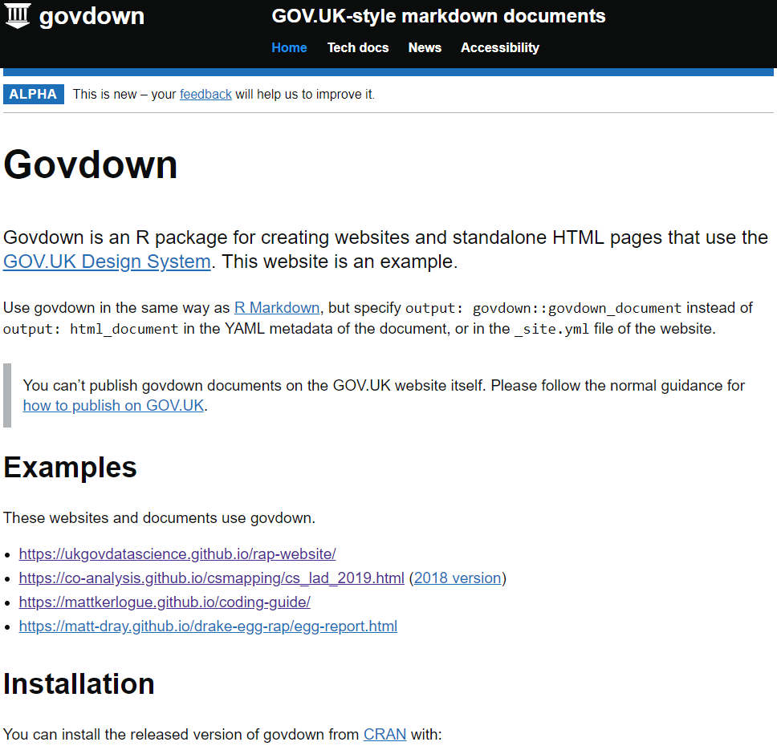 </a>

`govdown` - R [package](https://ukgovdatascience.github.io/govdown/) to recreate our UK government website template.

`drake` - R [package](https://pkg.garrickadenbuie.com/drake-intro/#1) to streamline reproducible pipelines in R.

`snapcraft` - python [package](https://snapcraft.io/docs/snapcraft-overview) to solve those dependency issues!

<a href="https://github.com/ropensci/drake">  </a>

<a href="https://snapcraft.io/docs/snapcraft-overview"> 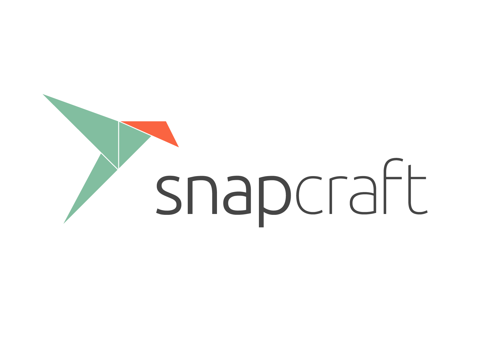 </a>

<div class="notes">
  As I've been researching Reproducible Analytical Pipelines I've been struct by some amazing tools people have created, here are a few.
</div>

## Mentorship at the Data Science Campus

<br>

<a href="https://datasciencecampus.ons.gov.uk/"> 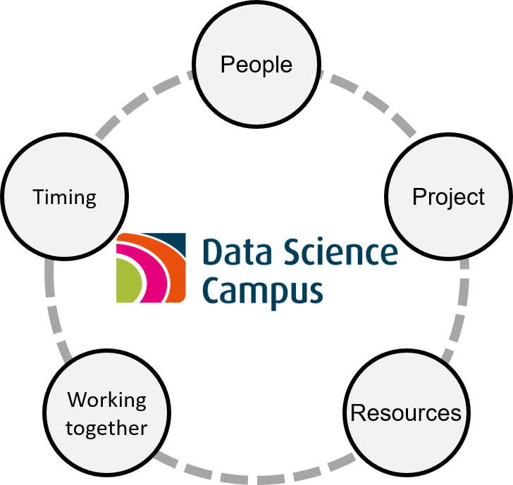 </a>

We aim to raise the aid community's capacity for using Data Science to meet the Sustainable Development Goals.

We'll link up Data Scientist mentors from the campus with mentees. Together we'll set plan out a project, describing:

- What the project is, its impact and scope
- The resources, expertise and time will we'll need
- And, how we'll work together during the project

<div class="notes">
  Here at the Campus we deliver mentoring projects. Helping to build reproducible data science capacity around the world to ensure we can effectively work towards the Sustainable Development Goals.
  
  The mentoring projects partner data scientists in the campus with analysts in national statistics offices. We consider a particular project to work on together and plan out what we'll need and how the mentoring can be best delivered.
</div>

## Mentorship at the Data Science Campus

<br>

<a href="https://datasciencecampus.ons.gov.uk/">  </a>

As we plan out our project, we'll be considering those sometimes difficult aspects of RAP:

- IT infrastructure available
- Data privacy - where and how am I storing my data?
- Expertise - what training do I need?
- Legacy systems - what are the barriers to transitioning?

<div class="notes">
  When considering a project to build a Reproducible Analytical Pipeline, it is important to reconsider those critical aspects that you'll need:
  
  - Access to the open-source tools
  - To make sure your data are secure and used appropriately
  - You need to learn to work with the open-source tools
  - And you need to consider whether there are any barriers to transitioning from an existing pipeline
</div>

## Useful resources

* The UK government RAP [website](https://ukgovdatascience.github.io/rap-website/index.html).

* A free RAP [course](https://www.udemy.com/course/reproducible-analytical-pipelines/) to teach you all you need to know.

* How the Data Science Campus sets its coding [standards](https://datasciencecampus.github.io/coding-standards/).

* A new open-source [book](https://the-turing-way.netlify.com) from the Alan Turing institute setting out how to do reproducible data science.

* The github page for this presentation and other materials is [here](https://github.com/datasciencecampus/gov-uk-rap-materials).

* Get involved in the UK government RAP champion network [here](https://gss.civilservice.gov.uk/about-us/champion-networks/reproducible-analytical-pipeline-rap-champions/).

<p class="aligncenter">
    <a href="https://datasciencecampus.ons.gov.uk/">  </a>
</p>

<div class="notes">
  Here are resources that I've found useful for learning about Reproducible Analytical Pipelines.
</div>

## Citing _The Turing Way_

Many of the beautiful images used in this presentation were taken from _The Turing Way_ book.

Full citation:

*The Turing Way Community, Becky Arnold, Louise Bowler, Sarah Gibson, Patricia Herterich, Rosie Higman, … Kirstie Whitaker. (2019, March 25). The Turing Way: A Handbook for Reproducible Data Science (Version v0.0.4). Zenodo. http://doi.org/10.5281/zenodo.3233986*

<div class="notes">
  This is just a quick shout out the The Turing Way - I've used a few of their incredible images and this book is well worth a read!
</div>
