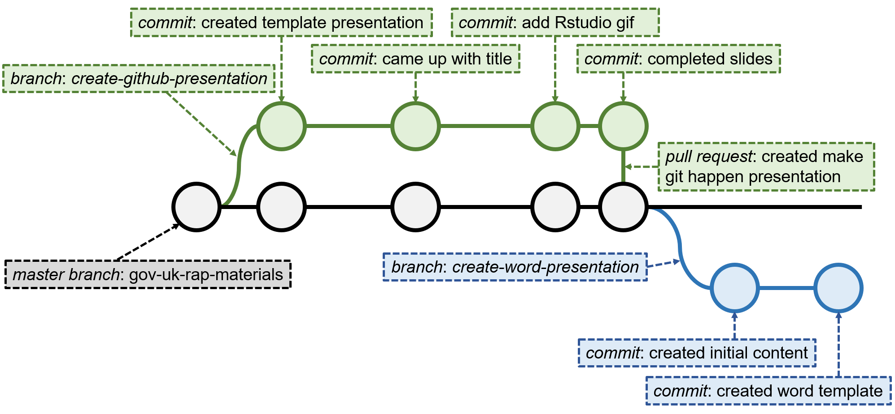

```{r setup, include=FALSE}
knitr::opts_chunk$set(echo = FALSE)
```

<!-- Extra custom code to add "OFFICIAL" into the header -->

<script src="https://ajax.googleapis.com/ajax/libs/jquery/1.12.2/jquery.min.js"></script>

<script>
    $(document).ready(function() {
      $('slide:not(.title-slide, .backdrop, .segue)').append('<header label=\"OFFICIAL\"></header>');    
    })
</script>

<style>
  header:after {
    content: attr(label);
    font-size: 12pt;
    position: absolute;
    top: 10px;
    left: 10px;
    line-height: 1.9;
  }
</style>

<!-- END custom code block for header -->

<!-- Extra custom code for footnotes - taken from https://stackoverflow.com/questions/42690955/how-to-insert-footnotes-in-ioslides-presentations-using-rmarkdown -->

## What is git?

"You use Git to take snapshots of all the files in a folder."

[_Alice Bartlett_](https://speakerdeck.com/alicebartlett/git-for-humans)

<br>

<p class="aligncenter">
    
</p>

## Snapshots in time

<p class="aligncenter">
    
</p>

## Three key concepts


<br>

- **Repository** - your project folder
- **Commit** - a snapshot of your folder
- **Branch** - working versions of your folder

## Three key concepts


<br>

- **Repository** - your project folder
- **Commit** - a snapshot of your folder
  * We use `push` to send the snapshots online
  * And `pull` to retrieve an updated snapshot
- **Branch** - we'll get to these! `r emo::ji("wink")`

## Work `git`!

<p class="aligncenter">
    
</p>

## Work `git`!

<p class="aligncenter">
    
</p>

## Installing `git`


<br>

- For Windows, download the executable [here](https://git-scm.com/download/win)
- On a mac type `git --version` in your terminal
- On linux machines type `sudo apt install git-all` in your terminal

<br>

_Note that you may need admin rights on your computer, without these you'll need to request an install._

## Create a GitHub account


<br>

GitHub offers a range of account types. A free account is available for organisations and individuals.

EVvn if you're in an institution, create a personal GitHub account to keep track of you own work.

You'll find more information, and links for creating an account, [here](https://help.github.com/en/github/getting-started-with-github/signing-up-for-a-new-github-account).

## Create a repository

[Add content here]

## Linking to RStudio


<br><br>

- Rstudio does a lot of the hard work for you
- You can use the terminal, if you like
- Here are some screenshots showing you how to link a GitHub repository to RStudio

## {data-background=images/LoadGitHubProjectInRStudio.gif data-background-size=100%}

## `git` working!

[Add content here]

## `git` the most out of GitHub


<br>

- Manage your work on a project using the [Projects](https://help.github.com/en/github/managing-your-work-on-github/about-project-boards) tab
- Track your tasks using [issues](https://help.github.com/en/github/managing-your-work-on-github/managing-your-work-with-issues) 
- Document your project using a [wiki](https://help.github.com/en/github/managing-your-work-on-github/about-project-boards)
- Host a [website](https://guides.github.com/features/pages/) on GitHub, check out these jekyl [themes](http://jekyllthemes.org/)

## Useful resources


- Introduction to GitHub presentation ([slides](https://speakerdeck.com/alicebartlett/git-for-humans) and [video](https://www.youtube.com/watch?v=eWxxfttcMts))
- All you need to know about GitHub in their [help](https://help.github.com/en) pages
- Detailed book about git, GitHub and R ([here](https://happygitwithr.com/))
- Detailed overview of RStudio, git and GitHub ([here](http://r-pkgs.had.co.nz/git.html))
- A game to help us think about git branches ([here](https://learngitbranching.js.org/))
- ONS GitHub introductory course ([here](https://github.com/datasciencecampus/version-control-with-git-github))
