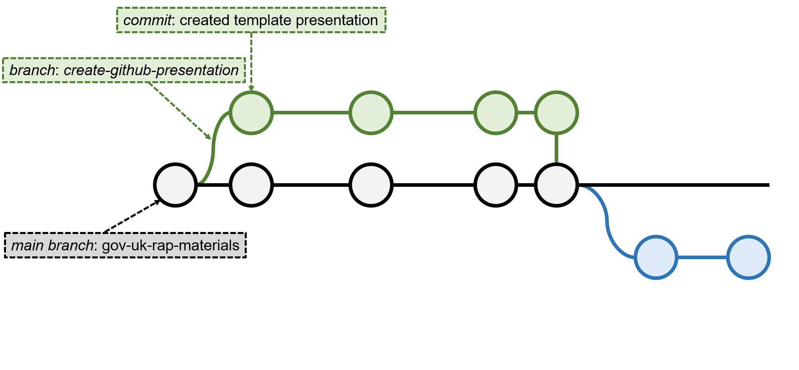
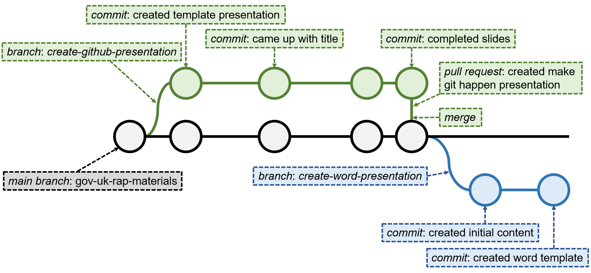

```{r setup, include=FALSE}
knitr::opts_chunk$set(echo = FALSE)
```

```{r load required libraries, include=FALSE}
library(kableExtra) # Extra nice tables
```

<!-- Extra custom code to add "OFFICIAL" into the header -->

<script src="https://ajax.googleapis.com/ajax/libs/jquery/1.12.2/jquery.min.js"></script>

<script>
    $(document).ready(function() {
      $('slide:not(.title-slide, .backdrop, .segue)').append('<header label=\"OFFICIAL\"></header>');    
    })
</script>

<style>
  header:after {
    content: attr(label);
    font-size: 12pt;
    position: absolute;
    top: 10px;
    left: 10px;
    line-height: 1.9;
  }
</style>

<!-- END custom code block for header -->

<!-- Extra custom code for footnotes - taken from https://stackoverflow.com/questions/42690955/how-to-insert-footnotes-in-ioslides-presentations-using-rmarkdown -->

<!-- PRESENTER NOTES
To view notes press "p" during the presentation on each slides with notes and an element with notes inside will appear. 

Note that you can use presenter mode by adding "presentme=true" to presentation url ("my-presentation.html?presentme=true"). Turn off presenter mode by adding "?presentme=false" to the url.

More information on "ioslides" available here: https://bookdown.org/yihui/rmarkdown/ioslides-presentation.html.
-->

## What is git?

"You use Git to take snapshots of all the files in a folder."

[_Alice Bartlett_](https://speakerdeck.com/alicebartlett/git-for-humans)

<br>

<p class="aligncenter">
    
</p>

<div class="notes">
  git is a version control tool. It is a way of keeping track of:
  
  - How are files are changing
  - Who is making those changes
  - When were the changes made
  - Why were the changes made
</div>

## Snapshots in time

<p class="aligncenter">
    
</p>

<div class="notes">
  On the left, we have a typical file version tracking systems. We create new files and include dates and flags to denote changes that were made. With this we quickly lose track of different versions of our files and we end up with a cluttered file system.
  
  On the right, we have the same file but monitored by git. It remains a single file throughout but git has recorded how, when, why and who has made what changes to the document. We can easily track back through how the document has changed.
</div>

## Snapshots in time

<p class="aligncenter">
    
</p>

<div class="notes">
  Here, we can see version control in action for this presentation. Recording what changes I have made, when I made them, and why I made them. And I can jump back to anyone of these older versions of my file.
</div>

## Three key concepts


<br>

- **Repository** - your project folder
- **Commit** - a snapshot of your folder
- **Branch** - a working version of your folder

<div class="notes">
  There are three key concepts to version control:

  1. Repository - this is the same as a folder on our computer. It's the place we keep all teh files we need for a particular project.
  2. Commit - this is how we tell git that we have made some changes we'd like it to record
  3. Branch - we can think of branches as a copy of our folder that we are currently working on for a particular task. Once we have completed the work we'll merge any changes back into the main copy of the repository.
</div>

## Three key concepts


<br>

- **Repository** - your project folder
- **Commit** - a snapshot of your folder
  * We use `push` to send the snapshots online
  * And `pull` to retrieve an updated snapshot
- **Branch** - a working version of your folder

<div class="notes">
  Alongside commit we have push and pull that allow us to push changes into our repository and pull changes from an updated version of the repository.
</div>

## Work `git`!

<p class="aligncenter">
    
</p>

<div class="notes">
  Here's an example of a repository - a set of files underpinning a project.
  
  The repository changes through time with checkpoints (circles) representing changes that have been recorded. 
  
  The repository also branches, with different branches representing different pieces of work.
</div>

## Work `git`!

<p class="aligncenter">
    
</p>

<div class="notes">
  In this case, the example repository is the repository that we use to store teaching materials we develop.
</div>

## Work `git`!

<p class="aligncenter">
    
</p>

<div class="notes">
  The green branch represents the piece of work I did to create this presentation. I started by creating a branch - a copy of the repository that I am going to work on independently until I have completed my task.
</div>

## Work `git`!

<p class="aligncenter">
    
</p>

<div class="notes">
 I then begin to work on my presentation, starting by creating the template that I am going to add content to.
</div>

## Work `git`!

<p class="aligncenter">
    
</p>

<div class="notes">
  Then I came up with a punchy title!
</div>

## Work `git`!

<p class="aligncenter">
    
</p>

<div class="notes">
  Then I added the presentation content.
</div>

## Work `git`!

<p class="aligncenter">
    
</p>

<div class="notes">
  Then I refined the content and finised the slides.
</div>

## Work `git`!

<p class="aligncenter">
    
</p>

<div class="notes">
  Happy with my work, I wanted to now add my work back into the main copy of my repository (the black branch).
  
  So I created a pull-request.
</div>

## Work `git`!

<p class="aligncenter">
    
</p>

<div class="notes">
  After reviewing the pull-request and making sure all the changes I made weren't going to affect any of the other files in the repository I merged the branch and the black branch took on the changes I'd made (and their history).
</div>

## Work `git`!

<p class="aligncenter">
    
</p>

<div class="notes">
  Now, onto a new presentation - about how we can generate microsoft word documents using a programming language.
  
  So I create a new branch (the blue branch).
</div>

## Work `git`!

<p class="aligncenter">
    
</p>

<div class="notes">
  And then I add a new presentation and work on the content.
</div>

## Work `git`!

<p class="aligncenter">
    
</p>

<div class="notes">
  Then I create a word document that I'll use as the template for my programming language.
  
  And that's where I've got to, this is an on-going piece of work, so the changes I've made aren't reflected in the main copy of the repository (the black branch).
</div>

## Work `git`!

<p class="aligncenter">
    
</p>

<div class="notes">
  So that's an example of how I've used git to keep track of how the teaching materials are being created.
</div>

## Installing `git`


<br>

- For Windows, download the executable [here](https://git-scm.com/download/win)
- On a mac type `git --version` in your terminal
- On linux machines type `sudo apt install git-all` in your terminal

<br>

_Note that you may need admin rights on your computer, without these you'll need to request an install._

<div class="notes">
  To get started with git, you'll need to install it on your computer following these instructions.
</div>

## Create a GitHub account


<br>

GitHub offers a range of account types. A free account is available for organisations and individuals.

Even if you're in an institution, create a personal GitHub account to keep track of you own work.

You'll find more information, and links for creating an account, [here](https://help.github.com/en/github/getting-started-with-github/signing-up-for-a-new-github-account).

<div class="notes">
  Next, you'll need to create a GitHub account - GitHub is the tool to interact with the git version control system. It is an incerdible open-source resources that is used by millions of people around the world to manage and record code development.
</div>

## Create a repository

- Follow the instructions [here](https://help.github.com/en/enterprise/2.16/user/github/getting-started-with-github/create-a-repo) to create your first repository
- Some key files to include:

  `README` - ideally format this as a markdown `md` file (more info [here](https://help.github.com/en/github/creating-cloning-and-archiving-repositories/about-readmes) and [here](https://github.com/18F/open-source-guide/blob/18f-pages/pages/making-readmes-readable.md))<br>
  
  `LICENSE` - how you want people to re-use your code ([info](https://help.github.com/en/github/creating-cloning-and-archiving-repositories/licensing-a-repository))<br>
  
  `.gitignore` - names of any files in your project you don't want on GitHub ([templates](https://github.com/github/gitignore/blob/master/README.md))<br>
  
<p class="aligncenter">
    
</p>

<div class="notes">
  Next we need to create a repository - a folder that we are going to use to store the files we need for a particular project.
  
  The repository has some key files:
  
  - The README.md - tells you and others about the project
  - The LICENCE - tells others how they can use your code and acknowledge your work
  - .gitignore - a file that allows us to target specific files that we don't want to track changes of - for example sensitive data files
</div>

## Managing your repository in the command line


- `git` is traditionally a command line tool
- Use these commands to navigate between folders in the command line:
  * `cd path/to/new/folder/` - use `cd` to move between folders (remember that "`..`" means go back one folder)
  * `ls` - to list the files and folders in your current folder (`dir` in Windows)
- Here's some more help for [Windows](https://www.digitalcitizen.life/command-prompt-how-use-basic-commands/), [mac](https://www.makeuseof.com/tag/mac-terminal-commands-cheat-sheet/), and [linux](https://www.hostinger.co.uk/tutorials/linux-commands) users
- Once you're happy with the above commands, here are some screenshots to illustrate using the command line to setup `git`

<div class="notes">
  With git installed, a GitHub account and repository created. We can use the command line to make a local copy of our repository and begin our project.
  
  The following screenshots illustrate how to use the command line to get started using git to track your work in a repository.
</div>

## {data-background=images/GitInCommandLine/GitInCommandLine_1.png data-background-size=100%}
<div class="notes">
  Start by navigating to your repository on GitHub using the browser.
</div>
## {data-background=images/GitInCommandLine/GitInCommandLine_2.png data-background-size=100%}
<div class="notes">
  Click on the green "Code" button and copy the url under HTTPS.
</div>
## {data-background=images/GitInCommandLine/GitInCommandLine_3.png data-background-size=100%}
<div class="notes">
  Open up your command line (dos, terminal, powershell will all work fine.)
  
  Type git clone and paste the url and press enter. The repository and its files will then be copied to your computer.
</div>
## {data-background=images/GitInCommandLine/GitInCommandLine_4.png data-background-size=100%}
<div class="notes">
  View the repository (folder) in your file directory. Note that I have created a local copy of the RAP materials repository.
</div>
## {data-background=images/GitInCommandLine/GitInCommandLine_5.png data-background-size=100%}
<div class="notes">
  I've selected README.md file and opened it to make some minor changes.
</div>
## {data-background=images/GitInCommandLine/GitInCommandLine_6.png data-background-size=100%}
<div class="notes">
  I've added a url to the git webpage.
</div>
## {data-background=images/GitInCommandLine/GitInCommandLine_7.png data-background-size=100%}
<div class="notes">
  Now I have returned to the command line and typeed the following commands one by one:
  
  - git add * 
  - git commit -m "I put a meaningful message here"
  - git push
  
  With these I have:
  - Told git to make a note of any files that have changed been added or removed
  - Committed any changes I found and written a meangingful message about the changes I made
  - And finally pushed my committed changes onto GitHub that stores the main copy of my repository
</div>

## {data-background=images/GitInCommandLine/GitInCommandLine_8.png data-background-size=100%}
<div class="notes">
  Now I can navigate back to my repository on GitHub using the brower.
  
  Note that the commit message has appeared.
</div>
## {data-background=images/GitInCommandLine/GitInCommandLine_9.png data-background-size=100%}
<div class="notes">
  And I can see that the change I made is now shown in the README - a with a hyperlink on the word git.
</div>

## `git` the most out of GitHub


<br>

- Manage your work on a project using the [Projects](https://help.github.com/en/github/managing-your-work-on-github/about-project-boards) tab
- Track your tasks using [issues](https://help.github.com/en/github/managing-your-work-on-github/managing-your-work-with-issues) 
- Use your README to describe your project (more info [here](https://help.github.com/en/github/creating-cloning-and-archiving-repositories/about-readmes) and [here](https://github.com/18F/open-source-guide/blob/18f-pages/pages/making-readmes-readable.md))
- Document your project using a [wiki](https://help.github.com/en/github/managing-your-work-on-github/about-project-boards)
- Host a [website](https://guides.github.com/features/pages/) on GitHub, check out these jekyl [themes](http://jekyllthemes.org/)

<div class="notes">
  GitHub is an extremely versatile tool that enables you to interact with git and also manage your project.
  
  - You can document tasks you need to complete.
  - Create READMEs, wiki, and even websites to document your projects
  - You can kanban boards to map your progress on tasks
  - You can share your work easily with others
  - And you can easily collaborate on the same project with others
  
</div>

## {data-background=images/VanuatuProjectsBoard.png data-background-size=100%}

<div class="notes">
  For example, here is the kanban board that documents a project we are working on with analysts in Vanuatu (in the Pacific) analyse trade statistics.
</div>

## Useful resources


- Introduction to GitHub presentation ([slides](https://speakerdeck.com/alicebartlett/git-for-humans) and [video](https://www.youtube.com/watch?v=eWxxfttcMts))
- All you need to know about GitHub in their [help](https://help.github.com/en) pages
- A game to help us think about git branches ([here](https://learngitbranching.js.org/))
- ONS GitHub introductory course ([here](https://github.com/datasciencecampus/version-control-with-git-github))
- [Tutorial](https://git-scm.com/book/en/v2/Getting-Started-The-Command-Line) about getting started with git in the command line
- All you need to know about `git` in the [git handbook](https://guides.github.com/introduction/git-handbook/)
- My own [git glossary](https://github.com/datasciencecampus/gov-uk-rap-materials/blob/master/git-glossary/git-command-glossary.csv) to remind me of the crucial `git` commands

<div class="notes">
  Here are some useful resources that will help you learn more about git and GitHub.
</div>

## `git` glossary

```{r create glossary table, echo=FALSE}
# Get the latest copy of the git glossary
glossary <- read.csv("https://raw.githubusercontent.com/datasciencecampus/gov-uk-rap-materials/master/git-glossary/git-command-glossary.csv")

# Wrap the code with markdown code apostrophes
glossary$Command <- paste0("`", glossary$Command, "`")

# Force row colours
options("kableExtra.html.bsTable"=TRUE)

# Create nice html visualisation
kable(glossary, format="html") %>%
  
  # Set the format
  kable_styling(bootstrap_options="striped", # Set the colour of rows
                full_width=FALSE, # Make the table not stretch to fit the page
                position="left", # Position the table on the left
                font_size=15) %>% # Change the font size
  
  # Make the table scrollable
  scroll_box(height = "450px")
```

<div class="notes">
  And here's a glossary of some of the most used commands for managing your repository with git in the command line.
</div>

