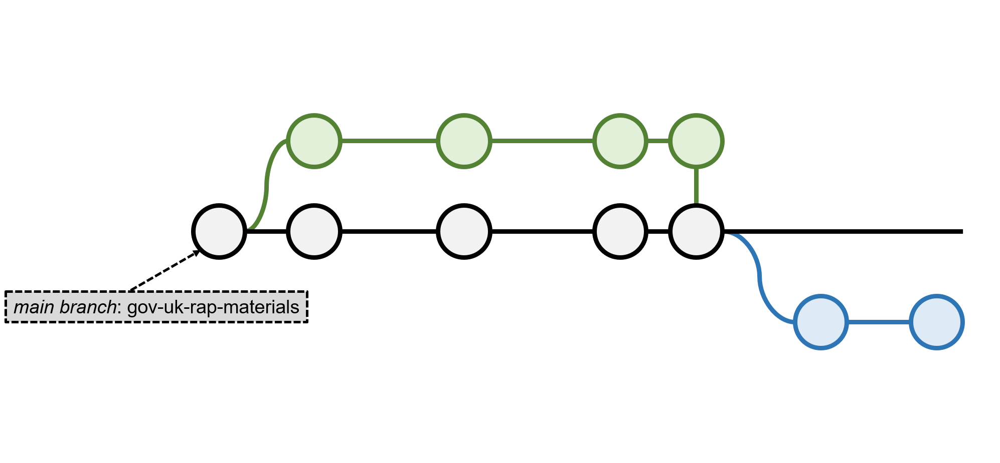

```{r setup, include=FALSE}
knitr::opts_chunk$set(echo = FALSE)
```

```{r load required libraries, include=FALSE}
library(kableExtra) # Extra nice tables
```

<!-- Extra custom code to add "OFFICIAL" into the header -->

<script src="https://ajax.googleapis.com/ajax/libs/jquery/1.12.2/jquery.min.js"></script>

<script>
    $(document).ready(function() {
      $('slide:not(.title-slide, .backdrop, .segue)').append('<header label=\"OFFICIAL\"></header>');    
    })
</script>

<style>
  header:after {
    content: attr(label);
    font-size: 12pt;
    position: absolute;
    top: 10px;
    left: 10px;
    line-height: 1.9;
  }
</style>

<!-- END custom code block for header -->

<!-- Extra custom code for footnotes - taken from https://stackoverflow.com/questions/42690955/how-to-insert-footnotes-in-ioslides-presentations-using-rmarkdown -->

<!-- PRESENTER NOTES
To view notes press "p" during the presentation on each slides with notes and an element with notes inside will appear. 

Note that you can use presenter mode by adding "presentme=true" to presentation url ("my-presentation.html?presentme=true"). Turn off presenter mode by adding "?presentme=false" to the url.

More information on "ioslides" available here: https://bookdown.org/yihui/rmarkdown/ioslides-presentation.html.
-->

## What is git?

"You use Git to take snapshots of all the files in a folder."

[_Alice Bartlett_](https://speakerdeck.com/alicebartlett/git-for-humans)

<br>

<p class="aligncenter">
    
</p>

<div class="notes">
  git is a version control tool. It is a way of keeping track of:
  
  - How are files are changing
  - Who is making those changes
  - When were the changes made
  - Why were the changes made
</div>

## Snapshots in time

<p class="aligncenter">
    
</p>

<div class="notes">
  On the left, we have a typical file version tracking systems. We create new files and include dates and flags to denote changes that were made. With this we quickly lose track of different versions of our files and we end up with a cluttered file system.
  
  On the right, we have the same file but monitored by git. It remains a single file throughout but git has recorded how, when, why and who has made what changes to the document. We can easily track back through how the document has changed.
</div>

## Snapshots in time

<p class="aligncenter">
    
</p>

<div class="notes">
  Here, we can see version control in action for this presentation. Recording what changes I have made, when I made them, and why I made them. And I can jump back to anyone of these older versions of my file.
</div>

## Three key concepts


<br>

- **Repository** - your project folder
- **Commit** - a snapshot of your folder
- **Branch** - a working version of your folder

<div class="notes">
  There are three key concepts to version control:

  1. Repository - this is the same as a folder on our computer. It's the place we keep all teh files we need for a particular project.
  2. Commit - this is how we tell git that we have made some changes we'd like it to record
  3. Branch - we can think of branches as a copy of our folder that we are currently working on for a particular task. Once we have completed the work we'll merge any changes back into the main copy of the repository.
</div>

## Three key concepts


<br>

- **Repository** - your project folder
- **Commit** - a snapshot of your folder
  * We use `push` to send the snapshots online
  * And `pull` to retrieve an updated snapshot
- **Branch** - a working version of your folder

## Work `git`!

<p class="aligncenter">
    
</p>

## Work `git`!

<p class="aligncenter">
    
</p>

## Work `git`!

<p class="aligncenter">
    
</p>

## Work `git`!

<p class="aligncenter">
    
</p>

## Work `git`!

<p class="aligncenter">
    
</p>

## Work `git`!

<p class="aligncenter">
    
</p>

## Work `git`!

<p class="aligncenter">
    
</p>

## Work `git`!

<p class="aligncenter">
    
</p>

## Work `git`!

<p class="aligncenter">
    
</p>

## Work `git`!

<p class="aligncenter">
    
</p>

## Work `git`!

<p class="aligncenter">
    
</p>

## Work `git`!

<p class="aligncenter">
    
</p>

## Work `git`!

<p class="aligncenter">
    
</p>

## Installing `git`


<br>

- For Windows, download the executable [here](https://git-scm.com/download/win)
- On a mac type `git --version` in your terminal
- On linux machines type `sudo apt install git-all` in your terminal

<br>

_Note that you may need admin rights on your computer, without these you'll need to request an install._

## Create a GitHub account


<br>

GitHub offers a range of account types. A free account is available for organisations and individuals.

Even if you're in an institution, create a personal GitHub account to keep track of you own work.

You'll find more information, and links for creating an account, [here](https://help.github.com/en/github/getting-started-with-github/signing-up-for-a-new-github-account).

## Create a repository

- Follow the instructions [here](https://help.github.com/en/enterprise/2.16/user/github/getting-started-with-github/create-a-repo) to create your first repository
- Some key files to include:

  `README` - ideally format this as a markdown `md` file (more info [here](https://help.github.com/en/github/creating-cloning-and-archiving-repositories/about-readmes) and [here](https://github.com/18F/open-source-guide/blob/18f-pages/pages/making-readmes-readable.md))<br>
  
  `LICENSE` - how you want people to re-use your code ([info](https://help.github.com/en/github/creating-cloning-and-archiving-repositories/licensing-a-repository))<br>
  
  `.gitignore` - names of any files in your project you don't want on GitHub ([templates](https://github.com/github/gitignore/blob/master/README.md))<br>
  
<p class="aligncenter">
    
</p>

## Managing your repository in the command line


- `git` is traditionally a command line tool
- Use these commands to navigate between folders in the command line:
  * `cd path/to/new/folder/` - use `cd` to move between folders (remember that "`..`" means go back one folder)
  * `ls` - to list the files and folders in your current folder (`dir` in Windows)
- Here's some more help for [Windows](https://www.digitalcitizen.life/command-prompt-how-use-basic-commands/), [mac](https://www.makeuseof.com/tag/mac-terminal-commands-cheat-sheet/), and [linux](https://www.hostinger.co.uk/tutorials/linux-commands) users
- Once you're happy with the above commands, here are some screenshots to illustrate using the command line to setup `git`

## {data-background=images/GitInCommandLine/GitInCommandLine_1.png data-background-size=100%}
## {data-background=images/GitInCommandLine/GitInCommandLine_2.png data-background-size=100%}
## {data-background=images/GitInCommandLine/GitInCommandLine_3.png data-background-size=100%}
## {data-background=images/GitInCommandLine/GitInCommandLine_4.png data-background-size=100%}
## {data-background=images/GitInCommandLine/GitInCommandLine_5.png data-background-size=100%}
## {data-background=images/GitInCommandLine/GitInCommandLine_6.png data-background-size=100%}
## {data-background=images/GitInCommandLine/GitInCommandLine_7.png data-background-size=100%}
## {data-background=images/GitInCommandLine/GitInCommandLine_8.png data-background-size=100%}
## {data-background=images/GitInCommandLine/GitInCommandLine_9.png data-background-size=100%}

## `git` the most out of GitHub


<br>

- Manage your work on a project using the [Projects](https://help.github.com/en/github/managing-your-work-on-github/about-project-boards) tab
- Track your tasks using [issues](https://help.github.com/en/github/managing-your-work-on-github/managing-your-work-with-issues) 
- Use your README to describe your project (more info [here](https://help.github.com/en/github/creating-cloning-and-archiving-repositories/about-readmes) and [here](https://github.com/18F/open-source-guide/blob/18f-pages/pages/making-readmes-readable.md))
- Document your project using a [wiki](https://help.github.com/en/github/managing-your-work-on-github/about-project-boards)
- Host a [website](https://guides.github.com/features/pages/) on GitHub, check out these jekyl [themes](http://jekyllthemes.org/)

## {data-background=images/VanuatuProjectsBoard.png data-background-size=100%}

## Useful resources


- Introduction to GitHub presentation ([slides](https://speakerdeck.com/alicebartlett/git-for-humans) and [video](https://www.youtube.com/watch?v=eWxxfttcMts))
- All you need to know about GitHub in their [help](https://help.github.com/en) pages
- A game to help us think about git branches ([here](https://learngitbranching.js.org/))
- ONS GitHub introductory course ([here](https://github.com/datasciencecampus/version-control-with-git-github))
- [Tutorial](https://git-scm.com/book/en/v2/Getting-Started-The-Command-Line) about getting started with git in the command line
- All you need to know about `git` in the [git handbook](https://guides.github.com/introduction/git-handbook/)
- My own [git glossary](https://github.com/datasciencecampus/gov-uk-rap-materials/blob/master/git-glossary/git-command-glossary.csv) to remind me of the crucial `git` commands

## `git` glossary

```{r create glossary table, echo=FALSE}
# Get the latest copy of the git glossary
glossary <- read.csv("https://raw.githubusercontent.com/datasciencecampus/gov-uk-rap-materials/master/git-glossary/git-command-glossary.csv")

# Wrap the code with markdown code apostrophes
glossary$Command <- paste0("`", glossary$Command, "`")

# Force row colours
options("kableExtra.html.bsTable"=TRUE)

# Create nice html visualisation
kable(glossary, format="html") %>%
  
  # Set the format
  kable_styling(bootstrap_options="striped", # Set the colour of rows
                full_width=FALSE, # Make the table not stretch to fit the page
                position="left", # Position the table on the left
                font_size=15) %>% # Change the font size
  
  # Make the table scrollable
  scroll_box(height = "450px")
```

