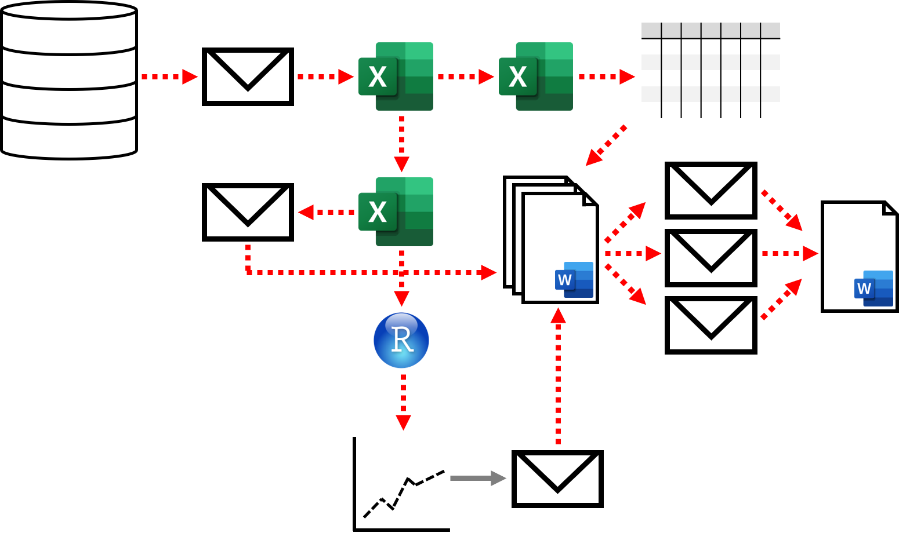
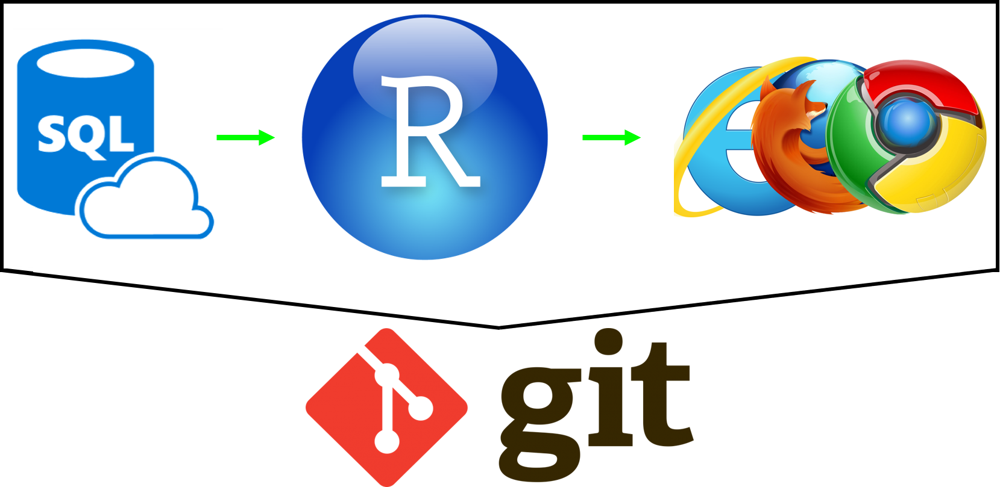
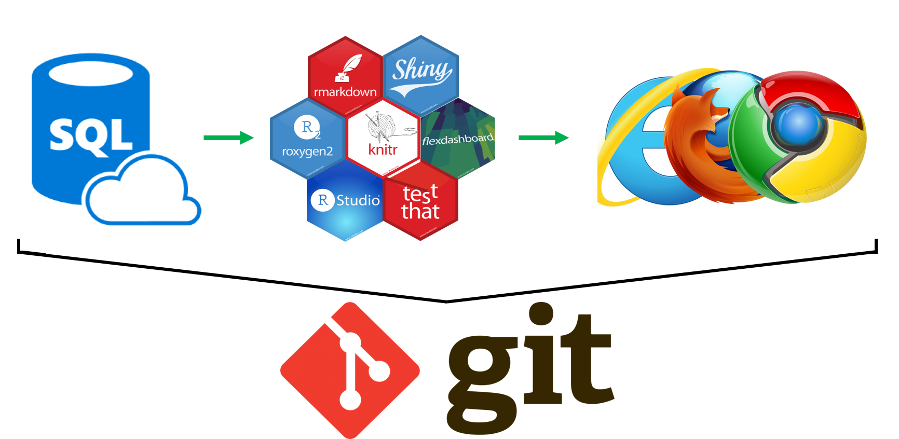
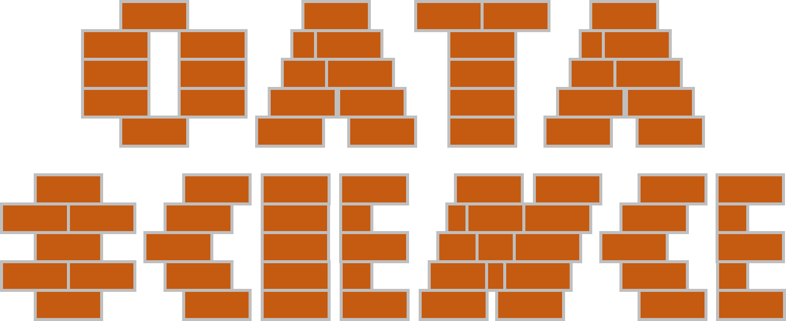

```{r setup, include=FALSE}
knitr::opts_chunk$set(echo = FALSE)
```

<!-- Extra custom code to add "OFFICIAL" into the header -->

<script src="https://ajax.googleapis.com/ajax/libs/jquery/1.12.2/jquery.min.js"></script>

<script>
    $(document).ready(function() {
      $('slide:not(.title-slide, .backdrop, .segue)').append('<header label=\"OFFICIAL\"></header>');    
    })
</script>

<style>
  header:after {
    content: attr(label);
    font-size: 12pt;
    position: absolute;
    top: 10px;
    left: 10px;
    line-height: 1.9;
  }
</style>

<!-- END custom code block for header -->


<!-- TO DO

- Copy in content from Nathan's slides
- Thinking of hypothetical project to update into RAP - refer to throughout

-->

## What is a Reproducible Analytical Pipeline (RAP)?

- It is easily repeatable
- It is easily extendable
- It is automated
- It minimises mistakes
- It is fast
- It builds trust

## Let's think about a traditional analysis



## What are the issues?

- Lots of manual steps
- Hard to repeat
- Mistakes are easy to make and hard to track
- The steps aren't recorded
- How do we keep track of which file versions people have?

## What about a RAP?



## All the functionality in one place



## What are the benefits?

- It is easy for others to use
- Others can change and adapt
- All steps are recorded
  - Including whilst it is built
- It is automated
- It is fast
- It is open and promotes trust

## Is it Data Science?



No, it is a building block that's essential for data science!

## What do we need?

- Open-source tools
- Version control with `git`
- To consider reproducibility
- Time to learn
  
## Why open-source instead of proprietary?

- Huge online community for support
- Flexible to all data sources
- Free for anyone to use - it is easier to share
- Flexible to all output types

## What is version control?

Tracking the three **W**s: **W**ho made **W**hich change and **W**hy? <br><br>


## For example, take a look at this [presentation](https://github.com/datasciencecampus/gov-uk-rap-materials)


## Why use version control?


<br>

- One place to store your code
- You and collaborators free to write and develop locally
- Complete documented history of all changes made
- Easy to share
- Your future self will thank you! :-)

## Which version control should I use?

| Tool      | Cost | Where is master? | Advantage         | Disadvantage
| --------- | ---- | ---------------- | ----------------- |
| [Github](https://github.com/) | Free | Online | Huge user base | \$\$\$ for private repositories 
| [Gitlab](https://about.gitlab.com/) | Free | Local or Online | Continuous integration | Smaller user base
| [Bitbucket](https://bitbucket.org/) | \$\$\$ | Cloud | Cloud security | Harder to share
| [Azure](https://azure.microsoft.com/en-us/services/devops/repos/) | \$\$\$ | Cloud | Cloud security | Harder to share

## What do we mean by reproducible?


In the future, we want to be able to look back at our work today and be able to repeat everything we've done easily

What we need to think about:
- What does our tool depend on?
- What sort of extreme cases could break our tool?
- What is each piece of code doing?

INSERT IMAGES

## Producing the publication

Usually involves writing and interpretation as well as a lot of copying and pasting images. 

Docoments are revised using comments, tracking changes, email, and creating copies

Why not use code to generate your report?

- LaTeX
- Markdown
- Jupyter notebook
- Rmarkdown

## Getting the balance right

Maintenance versus automation

## What are challenges?

- Infrastructure
- Data privacy
- Expertise
- Legacy systems

## Case studies ...

## Mentoring framework

## Useful resources

https://dataingovernment.blog.gov.uk/2017/03/27/reproducible-analytical-pipeline/

https://ukgovdatascience.github.io/rap-website/

https://the-turing-way.netlify.com
